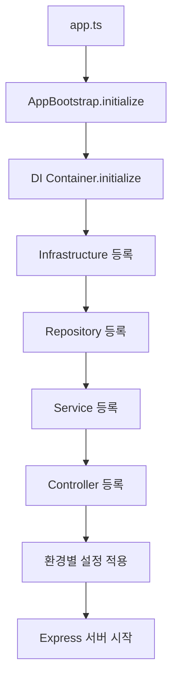
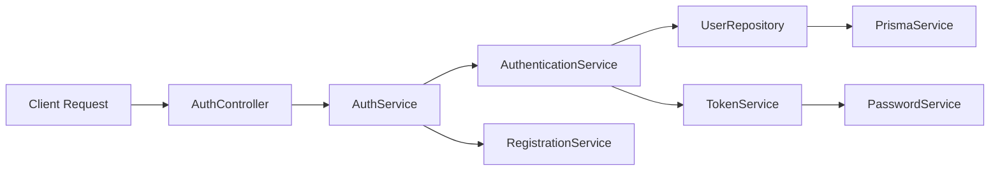

# Core 모듈 아키텍처 가이드

**PM_MonoRepo 백엔드의 핵심 인프라스트럭처**

## 개요

Core 모듈은 PM_MonoRepo 백엔드의 핵심 인프라스트럭처를 담당하는 모듈입니다. DI(Dependency Injection) Container 기반의 의존성 관리와 애플리케이션 부트스트랩, 환경 설정 관리를 통해 전체 애플리케이션의 기반을 제공합니다.

### 주요 책임
- **의존성 주입**: tsyringe 기반 DI Container 관리
- **애플리케이션 부트스트랩**: 초기화 과정 및 환경별 설정
- **설정 관리**: 환경변수 기반 중앙화된 설정 시스템
- **테스트 환경**: Mock 기반 테스트 인프라스트럭처

## 파일 구조

```
backend/src/core/
├── index.ts                    # 모듈 진입점 (Config export)
├── container.ts                # DI Container 메인 파일 ⭐ 핵심
├── app.bootstrap.ts            # 애플리케이션 부트스트랩
├── AGENTS.md                   # 에이전트 아키텍처 문서
└── config/
    ├── index.ts               # 설정 모듈 export
    └── config.ts              # 환경 설정 정의
```

### 파일별 역할

| 파일 | 역할 | 주요 기능 |
|------|------|----------|
| `container.ts` | DI Container 관리 | 의존성 등록/해결, Singleton 관리 |
| `app.bootstrap.ts` | 애플리케이션 초기화 | DI 초기화, 환경별 설정 적용 |
| `config/config.ts` | 설정 관리 | 환경변수 로드, 설정 중앙화 |

## DI Container 시스템

### 아키텍처 개요

DI Container는 **계층형 의존성 주입** 패턴을 사용하여 다음 순서로 의존성을 등록합니다:

```
Infrastructure → Repository → Service → Controller → Additional
```

### 핵심 클래스: `DIContainer`

```typescript
class DIContainer {
  private static instance: DIContainer;      // Singleton 패턴
  private isInitialized = false;             // 초기화 상태 관리

  async initialize(): Promise<void> {
    // 1. Infrastructure 레이어 등록
    this.registerInfrastructure();
    
    // 2. Repository 레이어 등록  
    this.registerRepositories();
    
    // 3. Service 레이어 등록
    this.registerServices();
    
    // 4. Controller 레이어 등록
    this.registerControllers();
    
    // 5. 추가 서비스 등록
    this.registerAdditionalServices();
  }
}
```

### 의존성 등록 순서와 이유

#### 1. Infrastructure 레이어
```typescript
private registerInfrastructure(): void {
  // PrismaClient 싱글톤 등록
  container.registerSingleton<PrismaClient>('PrismaClient', PrismaClient);
  
  // PrismaService 인스턴스 등록 (getInstance 패턴)
  container.registerInstance<PrismaService>('PrismaService', PrismaService.getInstance());
}
```
**이유**: 데이터베이스 연결 등 가장 기본적인 인프라가 먼저 준비되어야 함

#### 2. Repository 레이어
```typescript
private registerRepositories(): void {
  container.registerSingleton<UserRepository>('UserRepository', UserRepository);
  container.registerSingleton<CompanyRepository>('CompanyRepository', CompanyRepository);
  container.registerSingleton<TokenRepository>('TokenRepository', TokenRepository);
}
```
**이유**: 데이터 접근 계층이 비즈니스 로직보다 먼저 준비되어야 함

#### 3. Service 레이어 (3단계 구성)
```typescript
private registerServices(): void {
  // 1단계: 기본 서비스들 (외부 의존성 없음)
  container.registerSingleton<PasswordService>('PasswordService', PasswordService);
  container.registerSingleton<TokenService>('TokenService', TokenService);
  
  // 2단계: 비즈니스 로직 서비스들 (Repository 의존)
  container.registerSingleton<AuthenticationService>('AuthenticationService', AuthenticationService);
  container.registerSingleton<RegistrationService>('RegistrationService', RegistrationService);
  container.registerSingleton<ApprovalService>('ApprovalService', ApprovalService);
  
  // 3단계: Facade 서비스 (다른 서비스들 조합)
  container.registerSingleton<AuthService>('AuthService', AuthService);
}
```
**이유**: 서비스 간 의존성 순서를 고려한 단계적 등록

#### 4. Controller 레이어
```typescript
private registerControllers(): void {
  container.registerSingleton<AuthController>('AuthController', AuthController);
}
```
**이유**: 모든 하위 레이어가 준비된 후 최종적으로 등록

### DI Container 사용법

#### 의존성 해결
```typescript
// 컨테이너에서 인스턴스 가져오기
const authService = resolve<AuthService>('AuthService');

// 또는 직접 컨테이너 사용
const userRepo = diContainer.resolve<UserRepository>('UserRepository');
```

#### 테스트용 Mock 등록
```typescript
// 테스트에서 Mock 객체 주입
const mockUserRepo = createMockUserRepository();
registerMock('UserRepository', mockUserRepo);
```

## 애플리케이션 부트스트랩

### AppBootstrap 클래스

```typescript
class AppBootstrap {
  async initialize(): Promise<void> {
    // 1. DI Container 초기화
    await this.initializeDIContainer();
    
    // 2. 환경별 설정 적용
    this.configureEnvironment();
    
    // 3. 추가 설정들
    this.configureAdditionalSettings();
  }
}
```

### 환경별 설정

| 환경 | 특징 | 설정 |
|------|------|------|
| `development` | 개발 환경 | 디버깅 활성화, 상세 로그 |
| `production` | 운영 환경 | 보안 강화, 성능 최적화 |
| `test` | 테스트 환경 | Mock 사용, 격리된 DB |

### 사용법
```typescript
import { initializeApp } from '@core/app.bootstrap';

// 애플리케이션 시작 시
await initializeApp();

// 컨테이너에서 인스턴스 가져오기
const authController = resolveFromContainer<AuthController>('AuthController');
```

## 설정 관리 시스템

### 중앙화된 설정 구조

```typescript
export const config = {
  env: process.env.NODE_ENV || 'development',
  port: parseInt(process.env.PORT || '5000', 10),
  
  jwt: {
    secret: process.env.JWT_SECRET,
    expiresIn: process.env.JWT_EXPIRES_IN || '7d',
  },
  
  database: {
    uri: process.env.DATABASE_URI,
    host: process.env.DB_HOST || 'localhost',
    // ... 기타 DB 설정
  },
  
  redis: {
    host: process.env.REDIS_HOST || 'localhost',
    // ... 기타 Redis 설정
  },
  
  cors: {
    origin: process.env.CORS_ORIGIN?.split(',') || ['http://localhost:3000'],
    credentials: true,
  },
  
  rateLimit: {
    windowMs: 15 * 60 * 1000,  // 15분
    max: 100,                   // IP당 최대 100회
  }
} as const;
```

### 환경별 설정 활용

```typescript
import { config, isDevelopment, isProduction } from '@core/config';

// 환경별 분기 처리
if (isDevelopment) {
  console.log('개발 모드에서 실행 중...');
}

// 설정값 사용
app.listen(config.port, () => {
  console.log(`서버가 포트 ${config.port}에서 실행 중입니다.`);
});
```

## 테스트 환경

### TestDIContainer

테스트 환경에서는 실제 서비스 대신 Mock 객체를 주입하여 격리된 테스트 환경을 제공합니다.

```typescript
class TestDIContainer {
  async initialize(): Promise<void> {
    // 기존 Container 초기화
    container.clearInstances();
    
    // Mock Infrastructure 등록
    this.registerMockInfrastructure();
    
    // Mock Repository 등록
    this.registerMockRepositories();
    
    // ... Mock 서비스들 등록
  }
}
```

### Mock 서비스 구조

```typescript
// Mock 생성 및 등록
const mockPrismaService = createMockPrismaService();
const mockUserRepository = createMockUserRepository();
const mockCompanyRepository = createMockCompanyRepository();

// Container에 Mock 등록
container.register('PrismaService', { useValue: mockPrismaService });
container.register('UserRepository', { useValue: mockUserRepository });
```

### 테스트 사용법

```typescript
import { initializeTestDI, getMockService, resetAllTestMocks } from '@core/test-container';

describe('Auth Service Tests', () => {
  beforeAll(async () => {
    await initializeTestDI();  // Mock Container 초기화
  });
  
  beforeEach(() => {
    resetAllTestMocks();  // 각 테스트마다 Mock 리셋
  });
  
  it('should authenticate user', async () => {
    // Mock 서비스 가져오기
    const mockUserRepo = getMockService<UserRepository>('UserRepository');
    
    // Mock 데이터 설정
    mockUserRepo.findByEmail.mockResolvedValue(mockUser);
    
    // 테스트 실행
    const authService = resolveFromTestContainer<AuthService>('AuthService');
    const result = await authService.login(loginDto);
    
    // 검증
    expect(result.success).toBe(true);
  });
});
```

## 전체 워크플로우

### 애플리케이션 시작 과정



### 의존성 해결 과정



### 실행 순서

1. **애플리케이션 시작**
   ```typescript
   // app.ts
   import { initializeApp } from '@core/app.bootstrap';
   
   async function startServer() {
     await initializeApp();  // Core 모듈 초기화
     
     // Express 앱 설정 및 시작
     const app = express();
     app.listen(config.port);
   }
   ```

2. **DI Container 초기화**
   - Infrastructure → Repository → Service → Controller 순서로 등록
   - 각 레이어의 의존성 확인 및 주입

3. **환경별 설정 적용**
   - NODE_ENV에 따른 설정 분기
   - 개발/운영/테스트 환경별 최적화

4. **서비스 준비 완료**
   - 모든 의존성이 준비된 상태
   - HTTP 요청 처리 가능

## 실무 가이드

### 새로운 모듈 추가하기

1. **Repository 생성 및 등록**
   ```typescript
   // container.ts의 registerRepositories()에 추가
   container.registerSingleton<ProjectRepository>('ProjectRepository', ProjectRepository);
   ```

2. **Service 생성 및 등록**
   ```typescript
   // container.ts의 registerServices()에 추가
   container.registerSingleton<ProjectService>('ProjectService', ProjectService);
   ```

3. **Controller 생성 및 등록**
   ```typescript
   // container.ts의 registerControllers()에 추가
   container.registerSingleton<ProjectController>('ProjectController', ProjectController);
   ```

### 새로운 설정 추가하기

```typescript
// config/config.ts에 추가
export const config = {
  // ... 기존 설정들
  
  newFeature: {
    enabled: process.env.NEW_FEATURE_ENABLED === 'true',
    apiKey: process.env.NEW_FEATURE_API_KEY,
    timeout: parseInt(process.env.NEW_FEATURE_TIMEOUT || '30000', 10),
  },
} as const;
```

### Mock 서비스 추가하기

```typescript
// test-container.ts에 추가
const mockProjectRepository = createMockProjectRepository();
this.mockServices.set('ProjectRepository', mockProjectRepository);
container.register('ProjectRepository', { useValue: mockProjectRepository });
```

### 디버깅 및 트러블슈팅

#### DI Container 상태 확인
```typescript
// Container 초기화 상태 확인
console.log('Container initialized:', diContainer.initialized);

// 등록된 서비스 확인
try {
  const service = resolve<AuthService>('AuthService');
  console.log('Service resolved successfully');
} catch (error) {
  console.error('Service resolution failed:', error);
}
```

#### 일반적인 오류와 해결책

1. **"reflect-metadata를 import하지 않았습니다"**
   ```typescript
   // container.ts 맨 위에 추가
   import 'reflect-metadata';
   ```

2. **"서비스를 해결할 수 없습니다"**
   - Container에 서비스가 등록되었는지 확인
   - 등록 순서가 의존성을 고려했는지 확인

3. **"Circular dependency"**
   - 서비스 간 순환 참조 확인
   - 인터페이스나 Factory 패턴으로 해결

## 확장 가이드

### 외부 서비스 통합

```typescript
// container.ts의 registerAdditionalServices()에 추가
private registerAdditionalServices(): void {
  // Email Service
  container.registerSingleton<EmailService>('EmailService', EmailService);
  
  // Redis Cache
  container.registerSingleton<CacheService>('CacheService', CacheService);
  
  // File Storage
  container.registerSingleton<StorageService>('StorageService', StorageService);
}
```

### 환경별 확장

```typescript
// app.bootstrap.ts의 환경별 설정에 추가
private configureDevelopment(): void {
  // 개발 환경 전용 서비스 등록
  container.registerSingleton<DevToolsService>('DevToolsService', DevToolsService);
}

private configureProduction(): void {
  // 운영 환경 전용 서비스 등록
  container.registerSingleton<MonitoringService>('MonitoringService', MonitoringService);
}
```

## 성능 고려사항

### Singleton 패턴의 장점
- **메모리 효율성**: 인스턴스 재사용으로 메모리 절약
- **성능**: 인스턴스 생성 비용 최소화
- **상태 일관성**: 전역 상태 관리 용이

### 초기화 최적화
- **Lazy Loading**: 필요한 시점에만 인스턴스 생성
- **Parallel Initialization**: 독립적인 서비스들은 병렬 초기화
- **Error Handling**: 초기화 실패 시 Graceful Degradation

---

**작성일**: 2025-09-12  
**버전**: 1.0.0  
**작성자**: Claude Code Assistant

이 문서는 PM_MonoRepo 백엔드 Core 모듈의 아키텍처와 사용법을 상세히 다룹니다. 추가 질문이나 개선 사항이 있다면 언제든 말씀해 주세요.