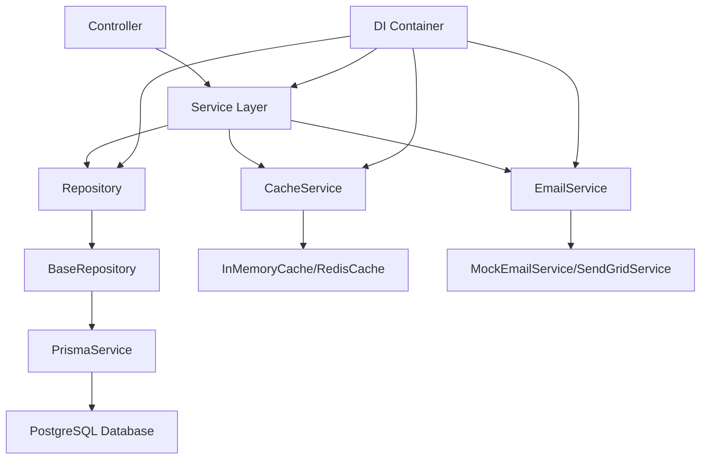

# Infrastructure 계층 아키텍처 가이드

**ProjectManager 백엔드 인프라스트럭처 계층의 구조, 기능, 워크플로우에 대한 종합 가이드**

## 📋 목차

1. [개요](#개요)
2. [디렉터리 구조](#디렉터리-구조)
3. [데이터베이스 계층](#데이터베이스-계층)
4. [캐시 계층](#캐시-계층)
5. [외부 서비스 계층](#외부-서비스-계층)
6. [워크플로우 및 의존성](#워크플로우-및-의존성)
7. [확장성 및 미래 구현](#확장성-및-미래-구현)
8. [베스트 프랙티스](#베스트-프랙티스)

---

## 개요

Infrastructure 계층은 ProjectManager 백엔드의 **데이터 영속성, 캐싱, 외부 서비스 통합**을 담당하는 핵심 계층입니다. 이 계층은 Clean Architecture 원칙에 따라 **비즈니스 로직으로부터 기술적 세부사항을 분리**하여 유지보수성과 테스트 가능성을 높입니다.

### 🎯 핵심 목표
- **관심사 분리**: 비즈니스 로직과 인프라스트럭처 로직의 명확한 분리
- **확장 가능성**: 미래 요구사항 변화에 대응할 수 있는 유연한 구조
- **테스트 용이성**: Mock/Stub을 통한 독립적인 테스트 지원
- **성능 최적화**: 캐싱과 연결 풀링을 통한 성능 향상

### 🏗️ 아키텍처 패턴
- **Repository Pattern**: 데이터 접근 로직의 추상화
- **Singleton Pattern**: 리소스 관리 및 연결 최적화
- **Strategy Pattern**: 환경별 서비스 구현체 교체 가능
- **Factory Pattern**: 인스턴스 생성 관리

---

## 디렉터리 구조

```
infrastructure/
├── index.ts                    # 메인 Export 파일
├── database/                   # 데이터베이스 계층
│   ├── index.ts               # Database 모듈 Export
│   ├── prisma.service.ts      # Prisma 클라이언트 싱글톤 서비스
│   └── base.repository.ts     # 베이스 Repository 추상 클래스 (모든 Repository의 부모)
├── cache/                      # 캐시 계층
│   ├── index.ts               # Cache 모듈 Export
│   └── redis.client.ts        # Redis/InMemory 캐시 클라이언트
└── external-services/          # 외부 서비스 연동
    ├── index.ts               # External Services Export
    └── email.service.ts       # 이메일 발송 서비스
```

> **Note**: Repository 구현체들은 이제 각 도메인 모듈에 위치합니다 (`modules/*/repositories/`)
> - `modules/auth/repositories/`: 인증 관련 Repository (User, Company, Token)
> - `modules/members/repositories/`: 멤버 관련 Repository
> - `modules/projects/repositories/`: 프로젝트 관련 Repository
> - `modules/tasks/repositories/`: 태스크 관련 Repository

---

## 데이터베이스 계층

### 🏛️ PrismaService - 데이터베이스 연결 관리

**위치**: `database/prisma.service.ts`

```typescript
export class PrismaService {
  private static instance: PrismaService;
  private client: PrismaClient;
  
  // 싱글톤 인스턴스 관리
  public static getInstance(): PrismaService
  public getClient(): PrismaClient
  public async connect(): Promise<void>
  public async disconnect(): Promise<void>
  public async transaction<T>(fn: (tx: any) => Promise<T>): Promise<T>
}
```

#### 🔧 주요 기능
- **싱글톤 패턴**: 애플리케이션 전체에서 단일 DB 연결 인스턴스 관리
- **환경별 로깅**: 개발 환경에서는 상세 쿼리 로깅, 프로덕션에서는 에러만
- **전역 인스턴스 관리**: HMR(Hot Module Replacement) 지원
- **트랜잭션 지원**: 복합 데이터 조작을 위한 트랜잭션 래퍼
- **에러 처리 헬퍼**: Prisma 에러 타입 식별 및 처리 유틸리티
- **재시도 로직**: 일시적 DB 연결 실패에 대한 지수 백오프 재시도

#### 💡 특별한 설계 고려사항
```typescript
// DI Container에서 수동 등록 (Singleton 특성 때문에 @injectable() 미사용)
if (process.env.NODE_ENV !== 'production') {
  globalForPrisma.prisma = this.client;  // HMR 지원을 위한 글로벌 인스턴스
}
```

---

### 🎯 BaseRepository - 공통 데이터 접근 패턴

**위치**: `database/base.repository.ts`

```typescript
export abstract class BaseRepository<T> {
  protected prisma: PrismaClient;
  protected model: any;
  
  // CRUD 기본 메서드들
  async findById(id: string, options?: FindOptions): Promise<T | null>
  async findOne(options: FindOptions): Promise<T | null>
  async findAll(options?: FindOptions): Promise<T[]>
  async create(data: any, options?: { include?: any; select?: any }): Promise<T>
  async update(id: string, data: any, options?: { include?: any; select?: any }): Promise<T>
  async delete(id: string): Promise<T>
  async count(where?: any): Promise<number>
  async paginate(options: FindOptions & PaginationOptions): Promise<PaginationResult<T>>
}
```

#### 🔧 핵심 특징
- **제네릭 타입 지원**: 타입 안정성을 보장하는 강타입 Repository
- **옵션 기반 쿼리**: include, select, orderBy 등 유연한 쿼리 옵션
- **페이지네이션**: 내장된 페이지네이션 로직과 메타데이터 제공
- **트랜잭션 헬퍼**: 복합 DB 작업을 위한 트랜잭션 래퍼
- **Raw 쿼리 지원**: 복잡한 쿼리를 위한 Raw SQL 실행 지원

#### 📊 페이지네이션 응답 구조
```typescript
interface PaginationResult<T> {
  data: T[];           // 실제 데이터
  total: number;       // 전체 레코드 수
  page: number;        // 현재 페이지
  totalPages: number;  // 전체 페이지 수
  hasNext: boolean;    // 다음 페이지 존재 여부
  hasPrev: boolean;    // 이전 페이지 존재 여부
}
```

---

### 🗂️ Repository 패턴 구현

Repository 구현체들은 이제 각 도메인 모듈 내에 위치하며, `BaseRepository`를 상속받아 구현됩니다.

#### Repository 위치 변경
**기존**: `infrastructure/database/repositories/*`
**현재**: `modules/*/repositories/*`

#### Repository 구현 예시

각 도메인 모듈의 Repository는 `BaseRepository`를 상속받아 도메인 특화 메서드를 추가합니다:

```typescript
// modules/auth/repositories/user.repository.ts
export class UserRepository extends BaseRepository<User> {
  async findByEmail(email: string): Promise<User | null>
  async findPendingMembers(companyId: string): Promise<User[]>
  // ... 기타 사용자 특화 메서드
}

// modules/auth/repositories/company.repository.ts
export class CompanyRepository extends BaseRepository<Company> {
  async findByInvitationCode(code: string): Promise<Company | null>
  async generateInvitationCode(): Promise<string>
  // ... 기타 회사 특화 메서드
}

// modules/auth/repositories/token.repository.ts
export class TokenRepository extends BaseRepository<RefreshToken> {
  async saveRefreshToken(userId: string, token: string): Promise<void>
  async invalidateTokenFamily(tokenFamily: string): Promise<void>
  // ... 기타 토큰 관리 메서드
}
```

#### 💡 모듈화의 장점
- **도메인 응집도**: 관련 로직이 한 모듈에 집중
- **독립적 테스트**: 모듈별 독립적인 테스트 가능
- **명확한 경계**: 각 모듈의 책임과 경계가 명확
- **재사용성**: BaseRepository를 통한 공통 로직 재사용

---

## 캐시 계층

### 💾 Redis Client - 캐싱 추상화

**위치**: `cache/redis.client.ts`

```typescript
interface CacheClient {
  get(key: string): Promise<string | null>;
  set(key: string, value: string, ttl?: number): Promise<void>;
  del(key: string): Promise<void>;
  exists(key: string): Promise<boolean>;
  expire(key: string, ttl: number): Promise<void>;
  flushall(): Promise<void>;
  disconnect(): Promise<void>;
}
```

#### 🔧 현재 구현: InMemoryCache
**개발 단계**에서 사용하는 메모리 기반 캐시 구현체:

```typescript
export class InMemoryCache implements CacheClient {
  private cache = new Map<string, { value: string; expiresAt?: number }>();
  
  // TTL 기반 만료 처리
  // 자동 cleanup 로직
  // 메모리 효율적 관리
}
```

#### 🎯 주요 특징
- **TTL 지원**: 자동 만료 처리
- **메모리 최적화**: 만료된 키 자동 정리
- **인터페이스 호환**: 실제 Redis와 동일한 API
- **개발 친화적**: 외부 의존성 없이 즉시 사용 가능

#### 📊 캐시 서비스 헬퍼
```typescript
export const cacheService = {
  async get<T>(key: string): Promise<T | null>      // JSON 파싱 자동화
  async set<T>(key: string, value: T, ttl?: number) // JSON 직렬화 자동화
  async del(key: string): Promise<void>
  async exists(key: string): Promise<boolean>
  // ...기타 편의 메서드들
}
```

#### 🚀 미래 Redis 확장 계획
```typescript
// 프로덕션에서 사용할 실제 Redis 구현체 (향후 구현)
export class RedisCache implements CacheClient {
  private client: RedisClientType;
  
  constructor() {
    this.client = createClient({
      host: process.env.REDIS_HOST || 'localhost',
      port: parseInt(process.env.REDIS_PORT || '6379'),
      // 연결 풀 설정
      // 클러스터 설정  
      // SSL/TLS 설정
    });
  }
}
```

---

## 외부 서비스 계층

### 📧 Email Service - 이메일 발송 추상화

**위치**: `external-services/email.service.ts`

```typescript
export interface IEmailService {
  sendPasswordResetEmail(to: string, resetToken: string): Promise<void>;
  sendWelcomeEmail(to: string, userName: string): Promise<void>;
  sendApprovalNotification(to: string, type: 'company' | 'member', status: 'approved' | 'rejected'): Promise<void>;
}
```

#### 🔧 현재 구현: MockEmailService
**개발 단계**에서 사용하는 콘솔 로깅 기반 Mock 서비스:

```typescript
export class MockEmailService implements IEmailService {
  async sendPasswordResetEmail(to: string, resetToken: string): Promise<void> {
    console.log(`[Mock Email] Password reset email sent to: ${to}`);
    console.log(`[Mock Email] Reset URL: ${process.env.FRONTEND_URL}/reset-password?token=${resetToken}`);
  }
  // ...기타 이메일 타입 처리
}
```

#### 🎯 비즈니스 이메일 타입
- **비밀번호 재설정**: 보안 토큰이 포함된 재설정 링크
- **환영 이메일**: 신규 사용자 온보딩
- **승인 알림**: 회사/팀원 승인 상태 변경 알림

#### 🚀 미래 확장 계획
```typescript
// SendGrid를 사용한 실제 이메일 서비스 (향후 구현)
export class SendGridEmailService implements IEmailService {
  private client: MailService;
  
  constructor() {
    this.client = new MailService();
    this.client.setApiKey(process.env.SENDGRID_API_KEY!);
  }
  
  async sendPasswordResetEmail(to: string, resetToken: string): Promise<void> {
    const msg = {
      to,
      from: process.env.FROM_EMAIL!,
      templateId: process.env.RESET_PASSWORD_TEMPLATE_ID!,
      dynamicTemplateData: {
        resetUrl: `${process.env.FRONTEND_URL}/reset-password?token=${resetToken}`,
      },
    };
    
    await this.client.send(msg);
  }
}
```

---

## 워크플로우 및 의존성

### 🔄 데이터 플로우 다이어그램



### 🏗️ 계층별 의존성 관계

#### 1️⃣ 데이터베이스 계층 의존성
```typescript
// 의존성 체인: Controller → Service → Repository → BaseRepository → PrismaService → Prisma Client
Repository (Concrete) 
    ↓ extends
BaseRepository<T> (Abstract)
    ↓ uses
PrismaService (Singleton)
    ↓ manages
PrismaClient (Prisma ORM)
    ↓ connects to
PostgreSQL Database
```

#### 2️⃣ 서비스 계층 통합
```typescript
// Service Layer에서 Infrastructure 계층 사용 패턴
@injectable()
export class AuthService {
  constructor(
    @inject('UserRepository') private userRepository: IUserRepository,
    @inject('TokenRepository') private tokenRepository: ITokenRepository,
    @inject('EmailService') private emailService: IEmailService
  ) {}
  
  async resetPassword(email: string) {
    const user = await this.userRepository.findByEmail(email);    // DB 접근
    const token = await this.tokenRepository.saveResetToken(...); // 토큰 저장
    await this.emailService.sendPasswordResetEmail(...);          // 이메일 발송
  }
}
```

#### 3️⃣ DI Container 등록 패턴
```typescript
// core/di/container.ts에서 Infrastructure 컴포넌트 등록
container.register<IUserRepository>('UserRepository', {
  useFactory: () => getUserRepository()
});

container.register<IEmailService>('EmailService', {
  useFactory: () => getEmailService()
});
```

### ⚡ 성능 최적화 포인트

#### 데이터베이스 최적화
- **연결 풀링**: PrismaService 싱글톤으로 연결 재사용
- **지연 로딩**: Repository 팩토리 패턴으로 필요시에만 초기화
- **페이지네이션**: 대용량 데이터 조회 최적화
- **트랜잭션 최적화**: 복합 작업의 원자성 보장

#### 캐시 최적화
- **TTL 관리**: 자동 만료를 통한 메모리 효율성
- **키 전략**: 도메인별 네임스페이스 분리
- **히트율 모니터링**: 캐시 효율성 측정 (향후 구현)

---

## 확장성 및 미래 구현

### 🎯 로드맵 우선순위

#### Phase 1: 기본 기능 안정화 ✅
- [x] PrismaService 싱글톤 구현
- [x] BaseRepository 추상화
- [x] 핵심 Repository 구현 (User, Company, Token)
- [x] Mock 서비스 구현 (Cache, Email)

#### Phase 2: 프로덕션 준비 🔄
- [ ] Redis 실제 구현
- [ ] SendGrid 이메일 서비스 구현
- [ ] 연결 풀 최적화
- [ ] 모니터링 및 로깅 강화

#### Phase 3: 고급 기능 📋
- [ ] 읽기 전용 DB 슬레이브 연결
- [ ] 캐시 분산 및 클러스터링
- [ ] 이메일 큐 시스템
- [ ] 메트릭 및 헬스 체크

### 🔧 확장 포인트들

#### 1. 새로운 Repository 추가
```typescript
// 새로운 도메인 Repository 구현 패턴
export class ProjectRepository extends BaseRepository<Project> implements IProjectRepository {
  constructor() {
    super(PrismaService.getInstance().getClient(), 'project');
  }
  
  // 프로젝트 특화 메서드들
  async findActiveProjects(): Promise<Project[]> { ... }
  async findByStatus(status: string): Promise<Project[]> { ... }
}
```

#### 2. 외부 서비스 확장
```typescript
// 새로운 외부 서비스 추가 패턴
export interface INotificationService {
  sendPushNotification(userId: string, message: string): Promise<void>;
  sendSlackNotification(channel: string, message: string): Promise<void>;
}

export class FirebaseNotificationService implements INotificationService {
  // Firebase FCM 구현
}
```

#### 3. 캐시 전략 확장
```typescript
// 캐시 레이어 추가 전략
export class MultiLevelCache implements CacheClient {
  constructor(
    private l1Cache: InMemoryCache,    // L1: 메모리 캐시
    private l2Cache: RedisCache        // L2: Redis 분산 캐시
  ) {}
  
  async get(key: string): Promise<string | null> {
    // L1 → L2 순서로 조회
    let value = await this.l1Cache.get(key);
    if (!value) {
      value = await this.l2Cache.get(key);
      if (value) await this.l1Cache.set(key, value, 300); // L1에 캐시
    }
    return value;
  }
}
```

---

## 베스트 프랙티스

### ✅ Repository 패턴 가이드라인

#### DO ✅
```typescript
// 인터페이스 우선 설계
interface IUserRepository {
  findByEmail(email: string): Promise<User | null>;
}

// 비즈니스 도메인 메서드명 사용
async findActiveUsers(): Promise<User[]>
async findPendingApprovals(): Promise<User[]>

// 트랜잭션을 활용한 복합 작업
async createUserWithCompany(userData: any, companyData: any) {
  return this.transaction(async (tx) => {
    // 원자성 보장
  });
}
```

#### DON'T ❌
```typescript
// 기술적 용어 노출 금지
async findUsersByPrismaWhere(where: any): Promise<User[]>

// 너무 범용적인 메서드
async findByAny(criteria: any): Promise<User[]>

// 비즈니스 로직 포함 금지
async findUserAndSendEmail(id: string): Promise<void>  // 서비스 계층 역할
```

### 🔐 보안 가이드라인

#### 토큰 관리
```typescript
// 토큰 해시 저장 (평문 저장 금지)
private hashToken(token: string): string {
  return crypto.createHash('sha256').update(token).digest('hex');
}

// 토큰 패밀리로 무효화 관리
async invalidateTokenFamily(tokenFamily: string): Promise<void>
```

#### 쿼리 보안
```typescript
// 파라미터화된 쿼리 사용
async raw<R = any>(query: string, params?: any[]): Promise<R> {
  return this.prisma.$queryRawUnsafe(query, ...(params || []));
}
```

### 📊 성능 최적화 가이드라인

#### 쿼리 최적화
```typescript
// 선택적 필드 조회
async findUserSummary(id: string) {
  return this.findById(id, {
    select: { id: true, name: true, email: true } // 필요한 필드만
  });
}

// 관계 데이터 미리 로딩
async findUserWithDetails(id: string) {
  return this.findById(id, {
    include: { company: true, projects: true }
  });
}
```

#### 캐시 활용
```typescript
// 캐시 키 네이밍 컨벤션
const CACHE_KEYS = {
  USER: (id: string) => `user:${id}`,
  COMPANY: (id: string) => `company:${id}`,
  USER_PROJECTS: (userId: string) => `user:${userId}:projects`
};

// TTL 설정 가이드라인
const CACHE_TTL = {
  SHORT: 300,   // 5분 - 자주 변경되는 데이터
  MEDIUM: 3600, // 1시간 - 보통 변경되는 데이터  
  LONG: 86400   // 24시간 - 거의 변경되지 않는 데이터
};
```

### 🧪 테스트 가이드라인

#### Repository 테스트
```typescript
describe('UserRepository', () => {
  let repository: UserRepository;
  let mockPrisma: jest.Mocked<PrismaClient>;

  beforeEach(() => {
    mockPrisma = createMockPrismaClient();
    repository = new UserRepository();
    // Repository에 Mock Prisma 주입
  });

  it('should find user by email', async () => {
    const mockUser = createMockUser();
    mockPrisma.user.findFirst.mockResolvedValue(mockUser);
    
    const result = await repository.findByEmail('test@example.com');
    
    expect(result).toEqual(mockUser);
    expect(mockPrisma.user.findFirst).toHaveBeenCalledWith({
      where: { email: 'test@example.com' }
    });
  });
});
```

---

## 🎯 핵심 포인트 요약

### Infrastructure 계층의 가치
1. **관심사 분리**: 비즈니스 로직과 기술적 세부사항의 명확한 분리
2. **확장 가능성**: 인터페이스 기반 설계로 구현체 교체 용이
3. **테스트 용이성**: Mock/Stub을 통한 독립적 테스트 환경
4. **성능 최적화**: 싱글톤, 캐싱, 연결 풀링을 통한 리소스 효율성

### 개발자를 위한 가이드
- **새 Repository 추가**: BaseRepository 상속 → 도메인 특화 메서드 구현 → 팩토리 함수 등록
- **새 외부 서비스 추가**: 인터페이스 정의 → 구현체 작성 → DI Container 등록
- **성능 문제 해결**: 쿼리 최적화 → 캐시 전략 → 인덱스 설계 순으로 접근
- **테스트 작성**: Repository별 독립 테스트 → Mock 객체 활용 → 비즈니스 시나리오 커버

---

**⚡ Infrastructure 계층은 ProjectManager의 든든한 기반입니다. 이 가이드를 참고하여 안정적이고 확장 가능한 코드를 작성해 주세요!**