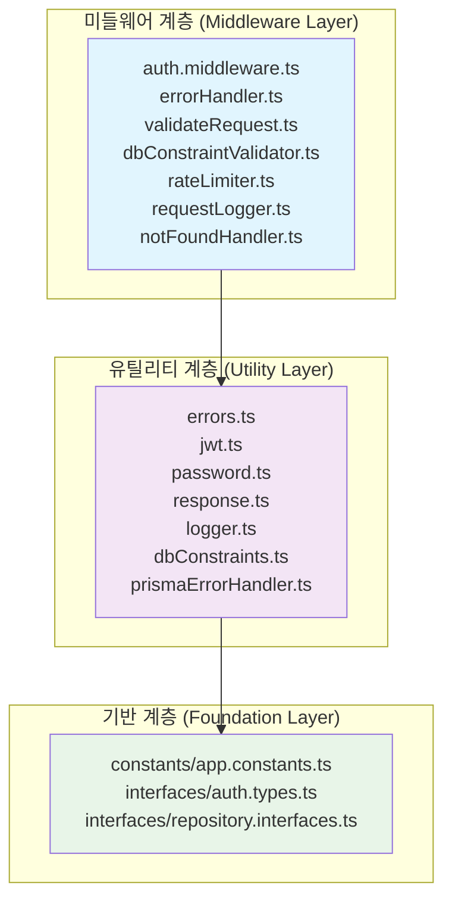
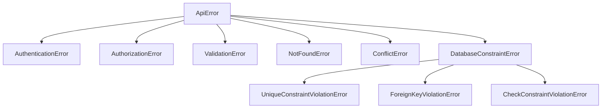
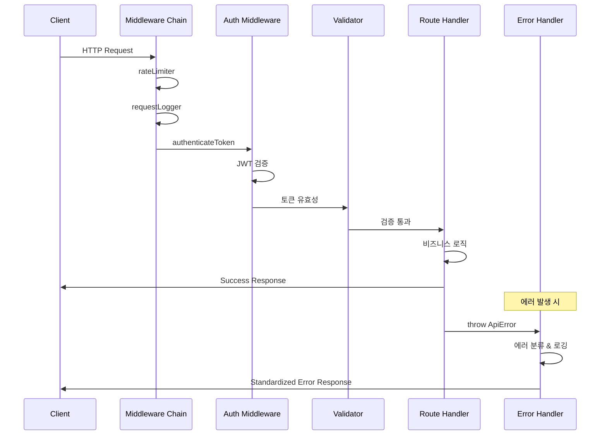
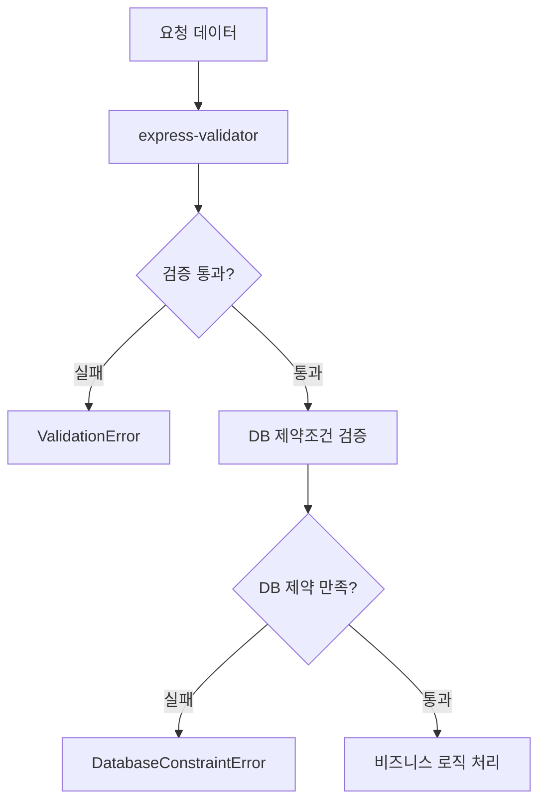

# Shared Module 아키텍처 가이드

**ProjectManager 백엔드의 공유 모듈 - 횡단 관심사와 공통 기능을 담당하는 핵심 인프라스트럭처**

## 📋 목차

- [1. 개요](#1-개요)
- [2. 디렉토리 구조](#2-디렉토리-구조)
- [3. 계층 아키텍처](#3-계층-아키텍처)
- [4. 핵심 컴포넌트](#4-핵심-컴포넌트)
- [5. 요청 처리 워크플로우](#5-요청-처리-워크플로우)
- [6. 아키텍처 패턴](#6-아키텍처-패턴)
- [7. 개발자 가이드](#7-개발자-가이드)

---

## 1. 개요

`backend/src/shared/` 디렉토리는 **횡단 관심사(Cross-Cutting Concerns)**를 담당하는 ProjectManager 백엔드의 핵심 인프라스트럭처입니다.

### 🎯 주요 목적
- **보안**: JWT 인증, 비밀번호 정책, 권한 관리
- **품질**: 에러 처리, 로깅, 검증 시스템  
- **표준화**: API 응답 포맷, 상수 정의
- **재사용성**: 공통 유틸리티와 인터페이스

### 📊 구성 현황
```
📁 shared/
├── 📁 middleware/     (7개 파일) - Express 미들웨어
├── 📁 constants/      (2개 파일) - 애플리케이션 상수
├── 📁 utils/          (8개 파일) - 공통 유틸리티
└── 📁 interfaces/     (3개 파일) - 타입 정의
```

---

## 2. 디렉토리 구조

### 🔧 Middleware (미들웨어)
Express 애플리케이션의 요청 처리 파이프라인을 구성하는 미들웨어들

| 파일 | 역할 | 핵심 기능 |
|-----|-----|-----------|
| `errorHandler.ts` | 글로벌 에러 처리 | Prisma 에러 변환, 로깅, 응답 표준화 |
| `auth.middleware.ts` | 인증/인가 | JWT 검증, 역할 기반 접근 제어, 회사별 격리 |
| `rateLimiter.ts` | API 제한 | 요청 빈도 제한 (15분/100회, 엄격 모드: 15분/5회) |
| `validateRequest.ts` | 입력 검증 | express-validator 기반 요청 데이터 검증 |
| `requestLogger.ts` | 요청 로깅 | HTTP 요청/응답 로깅, 성능 측정 |
| `notFoundHandler.ts` | 404 처리 | 존재하지 않는 엔드포인트 처리 |
| `dbConstraintValidator.ts` | DB 검증 | 데이터베이스 제약조건 사전 검증 (30개+ 검증자) |

### 📊 Constants (상수)
애플리케이션 전체에서 사용하는 상수와 설정값

| 파일 | 역할 | 주요 내용 |
|-----|-----|-----------|
| `app.constants.ts` | 시스템 상수 | HTTP 상태, 역할/상태 ID, 에러 코드, 메시지, 캐시/파일 설정 |

### 🛠 Utils (유틸리티)
공통 기능을 제공하는 유틸리티 클래스와 함수들

| 파일 | 역할 | 핵심 클래스/기능 |
|-----|-----|-----------------|
| `errors.ts` | 에러 시스템 | `ApiError` 기반 30개+ 세분화된 에러 클래스 |
| `response.ts` | API 응답 | `ResponseFormatter` - 표준화된 응답 생성 |
| `jwt.ts` | JWT 관리 | `JWTManager` - Access/Refresh/Reset 토큰 처리 |
| `password.ts` | 비밀번호 | `PasswordManager` - 해싱, 정책 검증, 강도 측정 |
| `logger.ts` | 로깅 | Winston 기반 구조화된 로깅 시스템 |
| `dbConstraints.ts` | DB 제약조건 | ID 패턴, 길이 제한, 범위 검증 규칙 |
| `prismaErrorHandler.ts` | Prisma 에러 | Prisma 에러를 도메인 에러로 변환 |

### 📝 Interfaces (인터페이스)
타입 안전성을 위한 인터페이스와 타입 정의

| 파일 | 역할 | 주요 타입 |
|-----|-----|-----------|
| `auth.types.ts` | 인증 타입 | `UserRole`, `AuthenticatedRequest`, 응답 DTO |
| `repository.interfaces.ts` | 저장소 패턴 | `IUserRepository`, `ITokenRepository`, `ICompanyRepository` |

---

## 3. 계층 아키텍처

shared 모듈은 **3계층 아키텍처**로 구성되며, 단방향 의존성을 유지합니다.



### 의존성 규칙
1. **미들웨어 계층** ← 유틸리티 계층 ← 기반 계층
2. 상위 계층은 하위 계층에만 의존
3. 순환 의존성 방지
4. 인터페이스를 통한 추상화

---

## 4. 핵심 컴포넌트

### 🔐 인증 시스템 (Authentication System)

#### JWTManager 클래스
```typescript
// 3가지 토큰 타입 관리
- Access Token (15분) - API 접근용
- Refresh Token (30일) - 토큰 갱신용  
- Reset Token (1시간) - 비밀번호 재설정용

// 보안 기능
- 토큰 순환(Token Rotation) 
- JTI 기반 토큰 추적
- 토큰 패밀리 관리
```

#### 인증 미들웨어
```typescript
authenticateToken()        // JWT 검증
requireSystemAdmin()       // 시스템 관리자 권한
requireCompanyManager()    // 회사 관리자 권한  
requireSameCompany()       // 같은 회사 소속 검증
requireActiveUser()        // 활성 사용자 검증
optionalAuth()            // 선택적 인증
```

### 🛡️ 에러 처리 시스템 (Error Handling System)

#### 계층적 에러 구조


### ✅ 검증 시스템 (Validation System)

#### DB 제약조건 검증
```typescript
// ID 패턴 검증
USER: /^usr_[a-zA-Z0-9]{6,}$/
COMPANY: /^cmp_[a-zA-Z0-9]{6,}$/  
PROJECT: /^prj_[a-zA-Z0-9]{6,}$/

// 데이터 길이 검증
EMAIL_MAX_LENGTH: 255
USER_NAME_MAX_LENGTH: 100
COMPANY_NAME_MAX_LENGTH: 200

// 범위 검증
PROGRESS_RATE: 0-100
PROJECT_STATUS: 1-5
```

### 📝 응답 표준화 (Response Standardization)

#### ResponseFormatter 클래스
```typescript
// 성공 응답
{
  "success": true,
  "data": {...},
  "message": "선택적 메시지"
}

// 에러 응답
{
  "success": false,
  "error": {
    "code": "ERROR_CODE",
    "message": "에러 메시지",
    "details": {...}
  },
  "timestamp": "ISO 8601"
}
```

---

## 5. 요청 처리 워크플로우

### 🔄 일반적인 API 요청 처리 흐름



### 🛡️ 보안 워크플로우


### 📋 검증 워크플로우



---

## 6. 아키텍처 패턴

### 🏗️ 적용된 설계 패턴

#### 1. 계층화 아키텍처 (Layered Architecture)
- **목적**: 관심사 분리와 의존성 관리
- **구현**: Foundation → Utility → Middleware
- **장점**: 모듈성, 테스트 용이성, 유지보수성

#### 2. 횡단 관심사 분리 (Cross-Cutting Concerns)
```typescript
// 각 관심사별 전담 모듈
로깅: logger.ts
보안: auth.middleware.ts, jwt.ts, password.ts  
검증: validateRequest.ts, dbConstraintValidator.ts
에러처리: errors.ts, errorHandler.ts
```

#### 3. 관리자 패턴 (Manager Pattern)
```typescript
JWTManager      // JWT 토큰 관리
PasswordManager // 비밀번호 관리
ResponseFormatter // 응답 포맷 관리
```

#### 4. 계층적 에러 처리 (Hierarchical Error Handling)
```typescript
ApiError (base)
├── AuthenticationError
├── ValidationError  
├── DatabaseConstraintError
│   ├── UniqueConstraintViolationError
│   └── ForeignKeyViolationError
```

#### 5. 의존성 역전 원칙 (Dependency Inversion)
```typescript
// 인터페이스 정의
interface IUserRepository {
  findById(id: string): Promise<User | null>;
}

// 구현체는 modules에서 주입
```

#### 6. 팩토리 패턴 (Factory Pattern)
```typescript
// 에러 팩토리 메서드들
ResponseFormatter.error()
ResponseFormatter.validationError()
ResponseFormatter.unauthorized()
```

### 🎯 SOLID 원칙 준수

| 원칙 | 적용 예시 | 효과 |
|------|-----------|------|
| **S**RP | 각 클래스가 단일 책임 (JWTManager, PasswordManager) | 코드 명확성 |
| **O**CP | 계층적 에러 시스템으로 확장 가능 | 유연성 |
| **L**SP | ApiError 하위 클래스들의 일관된 인터페이스 | 호환성 |
| **I**SP | 도메인별 Repository 인터페이스 분리 | 결합도 감소 |
| **D**IP | 인터페이스 의존, 구현체 주입 | 테스트 용이성 |

---

## 7. 개발자 가이드

### 🚀 새로운 기능 개발 시

#### 1. 에러 클래스 추가
```typescript
// errors.ts에 새로운 에러 클래스 추가
export class NewFeatureError extends ApiError {
  constructor(message: string, details?: any) {
    super(400, message, 'NEW_FEATURE_ERROR', details);
  }
}
```

#### 2. 미들웨어 추가
```typescript
// middleware 폴더에 새 파일 생성
export const newFeatureMiddleware = (req: Request, res: Response, next: NextFunction) => {
  // 검증 로직
  next();
};

// middleware/index.ts에서 export
export { newFeatureMiddleware } from './newFeatureMiddleware';
```

#### 3. 상수 추가
```typescript
// constants/app.constants.ts에 추가
export const NEW_FEATURE_CONSTANTS = {
  MAX_ITEMS: 100,
  TIMEOUT_MS: 5000,
} as const;
```

### 🔍 디버깅 가이드

#### 1. 로그 확인
```typescript
// logger 사용
import { logger } from '@shared/utils/logger';

logger.info('정보 메시지', { context: 'additional data' });
logger.warn('경고 메시지');
logger.error('에러 메시지', { error: errorObject });
```

#### 2. 에러 추적
```typescript
// 에러 발생 시 자동으로 로깅됨
// logs/error.log에서 확인 가능
// stack trace와 request context 포함
```

### 📋 테스트 작성

#### 1. 미들웨어 테스트
```typescript
describe('Auth Middleware', () => {
  test('should authenticate valid token', async () => {
    const req = mockRequest({ 
      headers: { authorization: 'Bearer valid_token' } 
    });
    const res = mockResponse();
    const next = jest.fn();
    
    await authenticateToken(req, res, next);
    
    expect(req.user).toBeDefined();
    expect(next).toHaveBeenCalled();
  });
});
```

#### 2. 유틸리티 테스트
```typescript
describe('PasswordManager', () => {
  test('should validate password policy', () => {
    const result = passwordManager.validatePasswordPolicy('ValidPass123!');
    expect(result.valid).toBe(true);
    expect(result.errors).toHaveLength(0);
  });
});
```

### ⚡ 성능 최적화

#### 1. JWT 토큰 캐싱
```typescript
// 블랙리스트 토큰을 Redis에 캐싱
// 데이터베이스 조회 최소화
```

#### 2. 로그 레벨 조정
```typescript
// 프로덕션에서는 ERROR, WARN만 활성화
// 개발환경에서는 DEBUG까지 활성화
```

### 🔒 보안 고려사항

#### 1. JWT 보안
```typescript
// 토큰 순환으로 보안 강화
// JTI 기반 토큰 추적
// 블랙리스트를 통한 즉시 무효화
```

#### 2. 비밀번호 보안
```typescript
// bcrypt를 사용한 안전한 해싱
// 강력한 비밀번호 정책 강제
// Salt rounds: 10 (보안과 성능의 균형)
```

#### 3. Rate Limiting
```typescript
// 일반 API: 15분/100회
// 엄격한 제한: 15분/5회 (로그인 등)
// IP 기반 제한으로 DDoS 방지
```

---

## 📈 메트릭스 및 모니터링

### 주요 지표
- **에러율**: 에러 타입별 발생 빈도
- **인증 성공률**: JWT 검증 성공/실패 비율  
- **응답 시간**: 미들웨어별 처리 시간
- **토큰 생성/갱신**: 토큰 관련 작업 빈도

### 로그 분석
```bash
# 에러 로그 확인
tail -f logs/error.log

# 특정 에러 타입 필터링
grep "AUTHENTICATION_ERROR" logs/error.log

# 요청 성능 분석
grep "POST /api" logs/combined.log | awk '{print $NF}' | sort -n
```

---

## 🔄 업그레이드 가이드

### 의존성 업데이트
```bash
# JWT 라이브러리 업데이트
npm update jsonwebtoken

# Express 미들웨어 업데이트
npm update express-rate-limit express-validator
```

### 호환성 유지
- 기존 API 인터페이스 유지
- 점진적 마이그레이션 지원
- 하위 호환성 고려한 버전 관리

---

**📅 최종 업데이트**: 2025년 9월  
**📝 문서 버전**: 1.0  
**🔧 지원 Node.js 버전**: 18.x+